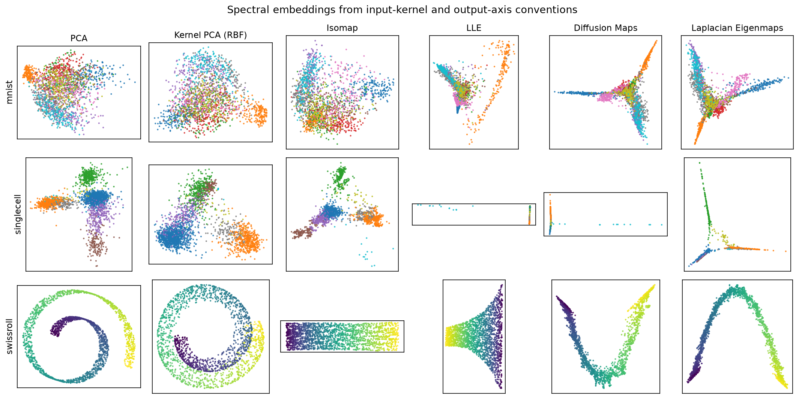
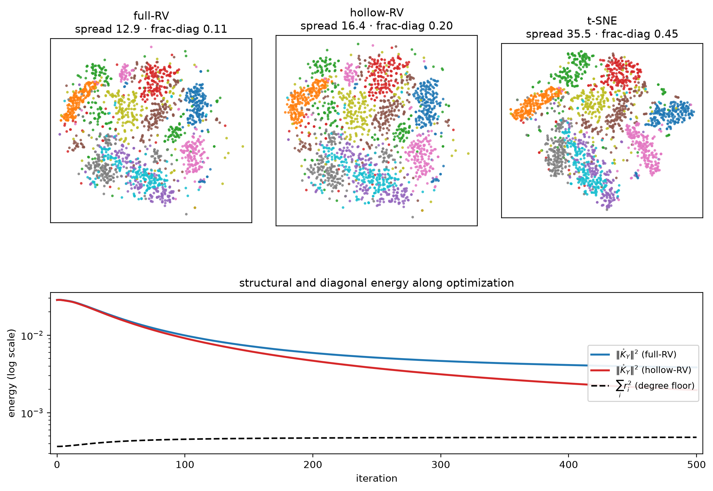
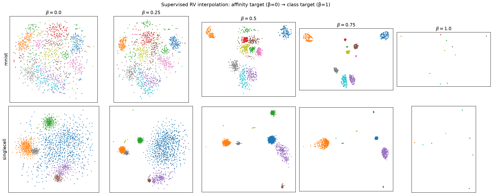
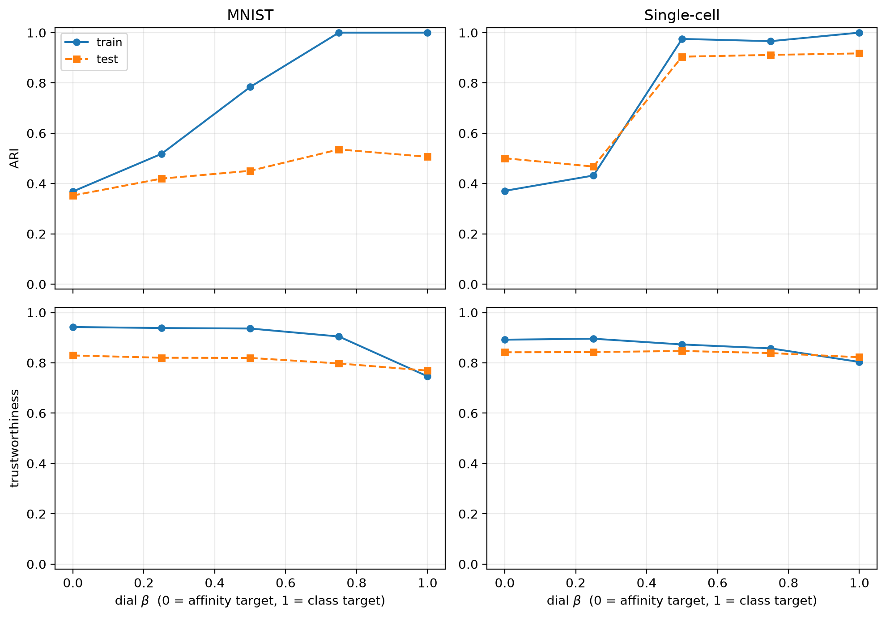

# The Kernel Inner Product Space : Dimensionality Reduction as Kernel Alignment

PCA, Kernel PCA, Isomap, LLE, Laplacian Eigenmaps, Diffusion Maps, t‑SNE, UMAP —
a crowded field of methods, each with its own objective, solver, and folklore.
This repository is the companion code to an article showing that they are **one
operation seen from different angles**: the projection of an input kernel onto the
set of output kernels a low‑dimensional embedding can reach, scored by a single
cosine — the **RV coefficient**.



*Every panel above is the **same** closed‑form operation — maximizing the RV cosine
between an input kernel and a linear output — applied to a different input kernel.
Change the kernel, change the method; the geometry stays put.*

---

## The idea in one minute

Represent both the data **X** and its embedding **Y** by centered kernels, and
measure their agreement by the cosine between them in matrix space:

$$\mathrm{RV}(\mathbf{K}_X,\mathbf{K}_Y)=\frac{\langle \mathbf{K}_X,\mathbf{K}_Y\rangle}{\lVert \mathbf{K}_X\rVert\,\lVert \mathbf{K}_Y\rVert}.$$

Fix the input kernel **K_X** and ask *which output kernels a q‑dimensional
configuration can produce*. Dimensionality reduction becomes: **project K_X onto
that achievable set.**

- **Linear output → a convex cone.** The projection is the classical truncated
  eigendecomposition (Eckart–Young), in **closed form**, with an exact **alignment
  ceiling** `RV_max`. PCA, Kernel PCA, Isomap, LLE, Laplacian Eigenmaps and
  Diffusion Maps are all its optima — for different input kernels. A class‑label
  target extends the same projection to a continuous **soft‑LDA**.
- **Heavy‑tailed (Student‑t) output → a smooth manifold** of exact dimension
  `nq − (q+1 choose 2)`. The RV gradient becomes **force‑directed**, and its
  attraction is a precise cousin of t‑SNE's.
- **The diagonal is a degree metric** whose energy *tethers* the embedding's
  spread; dropping it (the *hollow* RV) releases exactly the spread a bounded
  readout needs — the algebraic dial between MDS and neighbor embedding.
- **Repulsion is not in the objective.** The centering annihilates the one mode —
  the embedding's global volume — whose gradient *is* the repulsion of t‑SNE. So
  the framework is a relative of t‑SNE, and **cannot** be UMAP.

---

## Gallery

**The diagonal tether (§7.4).** Keep the kernel diagonal and the embedding stays
tethered (full‑RV, left); drop it and the spread is released toward t‑SNE (right).
The structural energy collapses while the degree floor stays pinned.



**A supervised dial, t‑SNE → classes (§7.5).** A single β blends both the input
target and the output kernel from an unsupervised t‑SNE (β=0) to pure class
centroids (β=1). Classes contract and separate continuously:



**…and the supervision generalizes.** On held‑out points whose labels were never
used, test ARI climbs with β (single‑cell 0.50 → 0.92, MNIST 0.35 → 0.54) while
trustworthiness holds near its t‑SNE level:



---

## Quickstart

The project uses [`uv`](https://docs.astral.sh/uv/) (Python ≥ 3.12):

```bash
uv sync                      # create the environment from uv.lock
```

Run the snippet from the repository root — a REPL, `uv run python -c "..."`, or a
script saved at the root — so that `from src ...` resolves.

```python
from src.datasets import load_all
from src.rv_kernels import (
    compute_linear_kernel_torch, spectral_embed_linear, rv_ceiling,
    gaussian_affinity_base, soften_and_center, rv_dimred, default_weights,
)
from src.benchmark_common import get_device, pca_init

device = get_device()                     # "cuda" | "mps" | "cpu"
ds = load_all()["mnist"]                   # ds.X : (n, d),  ds.labels : (n,)
X = ds.X

# ── Linear regime — closed form (this IS PCA) ──────────────────────────────
K = compute_linear_kernel_torch(X, device=device)        # centered input kernel K_X
Y, rv = spectral_embed_linear(K, q=2, device=device)     # top-q eigenprojection
print(rv, "==", rv_ceiling(K, q=2))        # the optimum reaches the ceiling exactly

# Change the method by changing the input kernel: compute_rbf_kernel_torch → Kernel
# PCA, compute_geodesic_kernel_torch → Isomap, compute_diffusion_kernel_torch → …

# ── Non-linear regime — gradient (t-SNE-like Student-t output) ─────────────
w    = default_weights(len(X), device)
base = gaussian_affinity_base(X, perplexity=30)          # symmetric t-SNE affinity
K_ag = soften_and_center(base, 0.5, weights=w, device=device)   # γ = 0.5 softening
Y, rv = rv_dimred(
    K_ag, output_kernel="student_t", q=2,
    init=pca_init(X), device=device, hollow=True,        # hollow = neighbor-embedding
)
```

That is the whole interface: **build an input kernel, pick an output kernel,
maximize the RV coefficient** — in closed form on the cone, by gradient on the
manifold. The supervised dial is the same call with a blended input/output kernel;
see [`experiments/05_supervised_dial/`](experiments/05_supervised_dial/).

---

## Reproducing the paper

Each case study of §7 is one self‑contained folder under
[`experiments/`](experiments/), validating one prediction of the theory:

| Experiment | Validates | Run |
|---|---|---|
| [`01_spectral/`](experiments/01_spectral/) | closed‑form recovery + alignment ceiling | `uv run python experiments/01_spectral/spectral_run.py` |
| [`02_manifold_dim/`](experiments/02_manifold_dim/) | manifold dimensions `nq − (q+1 choose 2)` (distance) and `nq − (q choose 2)` (dot‑product) | `uv run python experiments/02_manifold_dim/manifold_dim_run.py` |
| [`03_forces/`](experiments/03_forces/) | gradient force identities + cross‑Procrustes | `uv run python experiments/03_forces/forces_check.py` |
| [`04_tether/`](experiments/04_tether/) | the diagonal tether (Figure 1) | `uv run python experiments/04_tether/tether_run.py` |
| [`05_supervised_dial/`](experiments/05_supervised_dial/) | the supervised dial (Figure 2) | `uv run python experiments/05_supervised_dial/supervised_dial_run.py` |

Each folder pairs a `*_run.py` (embeddings) with `*_indices.py` / `*_figure.py`
(metrics and figures); outputs land in the mirrored
[`results/`](results/) tree. Seeds are fixed.

---

## Repository layout

```
src/                 the library — one import away
  rv_kernels.py        input/output kernels, closed-form solvers, rv_dimred
  datasets.py          MNIST, PBMC3k single-cell, Swiss roll loaders
  indices.py           Procrustes, kNN overlap, trustworthiness
  benchmark_common.py  shared constants, devices, helpers
experiments/         one folder per §7 case study (reproduces the paper)
showcase/            gallery scripts (this README's figures, extra sweeps)
results/             coordinates, indices, and figures (mirrors experiments/)
rv_dimred_new/       the article (LaTeX source + PDF)
archive/             superseded scripts and the previous paper
```

---

## Citation

> Guex, G. *The Kernel Inner Product Space: Dimensionality Reduction as Kernel
> Alignment.* Department of Language and Information Sciences, University of
> Lausanne. (In preparation.)
