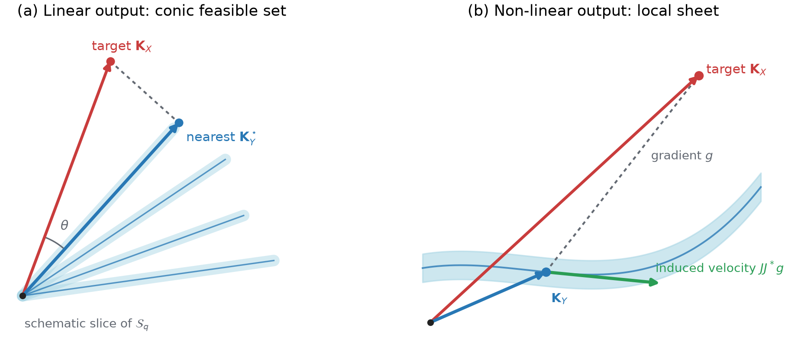
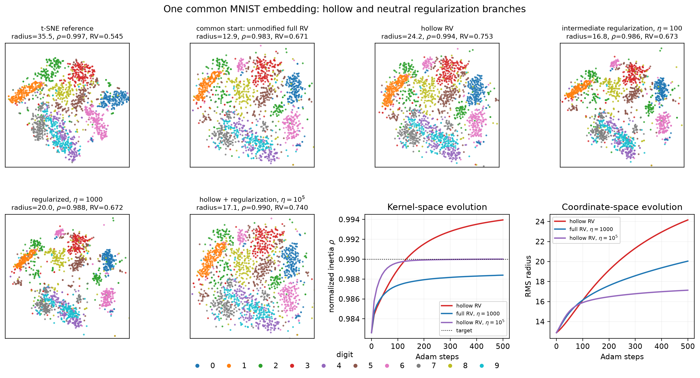

# The Kernel Inner Product Space: Dimensionality Reduction as Kernel Alignment

This repository contains the code and numerical results for the TMLR submission
[*The Kernel Inner Product Space: Dimensionality Reduction as Kernel
Alignment*](https://openreview.net/forum?id=UxUdmXFV0Z).

The paper represents both the input data and a low-dimensional configuration by
centered kernel matrices. Their agreement is measured by the RV coefficient,
which is the cosine of the angle between the two kernels in matrix space:

$$
\text{RV}(K_X,K_Y)
=\frac{\langle K_X,K_Y\rangle_F}
{\lVert K_X\rVert_F\,\lVert K_Y\rVert_F}.
$$

Dimensionality reduction can then be studied as the search for an attainable
output kernel whose direction is aligned with a fixed input kernel.

## A common kernel-space view of spectral methods


*Six spectral methods on MNIST, PBMC3k, and the Swiss roll. Each method is
expressed through an input kernel and a closed-form spectral readout. PCA,
Kernel PCA, Isomap, and Diffusion Maps use eigenvalue-scaled axes; LLE and
Laplacian Eigenmaps use balanced orthonormal axes. The kernel-space formulation
makes both the common structure and the output-convention distinction explicit.*

## Geometry of the search



*For a linear readout, attainable kernels form a rank-constrained cone. For a
nonlinear readout, the coordinate map has a smooth local image under the usual
constant-rank conditions. In both cases, RV is the cosine of the kernel angle.*

## Main ideas

- **Linear readout.** The set of centered positive semidefinite kernels of rank
  at most $q$ is a cone, but it is generally nonconvex. For eigenvalue-scaled
  spectral methods, truncated eigendecomposition gives the exact RV optimum and
  an alignment ceiling. Methods with balanced axes use a different output
  convention and should be distinguished from this projection.
- **Nonlinear readout.** A kernel such as the centered Student-t affinity maps
  coordinates to a curved subset of kernel space. The differential of this map
  turns the RV gradient into pairwise forces. The geometric description is local;
  it does not require the full image to be a global manifold.
- **Full and hollow RV.** Removing the diagonal changes the inner product on the
  hollow coordinates. It is therefore a different kernel-space metric, not a
  universal mechanism that guarantees a particular coordinate spread.
- **Neutral-component regularization.** A squared kernel-space penalty controls
  the trace, or equivalently the component along the neutral centered kernel. It
  leaves the linear spectral solution unchanged up to scale and adds a
  sign-changing force for the Student-t readout. It controls kernel inertia; it
  does not impose a hard bound on individual coordinates.
- **Supervised interpolation.** A parameter $\beta$ jointly interpolates the
  input target from an adaptive affinity kernel to a class kernel and the output
  readout from Student-t to linear. Held-out points are extended from their
  features without using their labels.

The RV-Student-t construction is related to t-SNE through its affinity profile
and force form, but it is not the t-SNE objective. Likewise, using a UMAP-shaped
readout does not reproduce the full UMAP algorithm. The experiments test the
geometric correspondences and constructions; they do not claim general
performance superiority over reference methods.

## Current figures

**Kernel-space regularization on the same MNIST sample and common starting
configuration.** The comparison contains the t-SNE reference, the unmodified
full-RV solution, hollow RV, two strengths of neutral regularization, and the
combined hollow plus regularized objective.



**Supervised interpolation.** The curves report ARI and trustworthiness on the
fixed train/test protocol for MNIST and PBMC3k. They describe this experimental
split and out-of-sample rule, not a generalization guarantee.


## Quickstart

The project requires Python 3.12 or newer and uses
[`uv`](https://docs.astral.sh/uv/) for its environment:

```bash
uv sync
```

Run the following from the repository root:

```python
from src.benchmark_common import get_device, pca_init
from src.datasets import load_mnist
from src.rv_kernels import (
    compute_linear_kernel_torch,
    default_weights,
    gaussian_affinity_base,
    rv_ceiling,
    rv_dimred,
    soften_and_center,
    spectral_embed_linear,
)

device = get_device()
X = load_mnist().X

# Linear readout: exact rank-2 spectral solution.
K = compute_linear_kernel_torch(X, device=device)
Y_linear, rv = spectral_embed_linear(K, q=2, device=device)
print(rv, rv_ceiling(K, q=2))

# Nonlinear readout: optimize RV with a centered Student-t output kernel.
w = default_weights(len(X), device)
base = gaussian_affinity_base(X, perplexity=30)
K_affinity = soften_and_center(base, 0.5, weights=w, device=device)
Y_nonlinear, rv = rv_dimred(
    K_affinity,
    output_kernel="student_t",
    q=2,
    init=pca_init(X),
    device=device,
    hollow=True,
)
```

Here `hollow=True` evaluates the cosine after removing both kernel diagonals. It
selects the hollow RV metric; it does not turn the objective into t-SNE.

## Reproducing the experiments

The scripts below write their coordinates, indices, and figures to the matching
directory under [`results/`](results/README.md). Seeds and dataset subsamples are
fixed in the experiment configuration.

| Directory | Purpose | Main command |
|---|---|---|
| [`01_spectral/`](scripts/experiments/01_spectral/) | spectral recovery and RV ceiling | `uv run python scripts/experiments/01_spectral/spectral_run.py` |
| [`02_manifold_dim/`](scripts/experiments/02_manifold_dim/) | numerical ranks of coordinate-to-kernel maps | `uv run python scripts/experiments/02_manifold_dim/manifold_dim_run.py` |
| [`03_forces/`](scripts/experiments/03_forces/) | force identities and cross-method Procrustes comparisons | `uv run python scripts/experiments/03_forces/forces_check.py` |
| [`05_supervised_dial/`](scripts/experiments/05_supervised_dial/) | supervised interpolation with a fixed train/test split | `uv run python scripts/experiments/05_supervised_dial/supervised_dial_run.py` |
| [`06_regularization/`](scripts/experiments/06_regularization/) | neutral-component regularization and MNIST comparison | `uv run python scripts/experiments/06_regularization/mnist_hollow_regularization.py` |
| [`figures/`](scripts/figures/) | schematic kernel geometry | `uv run python scripts/figures/kernel_geometry_overview.py` |

Experiment `04_tether` is retained as a historical baseline because experiment
06 reuses its saved MNIST sample, t-SNE reference, and full-RV starting
coordinates. Its former interpretation as a general diagonal-tether result is
not part of the revised manuscript.

The dense nonlinear implementation requires $O(n^2)$ memory and approximately
$O(n^2q)$ work per optimization step. A full spectral decomposition costs
$O(n^3)$ in the current implementation.

## Repository layout

```text
src/                    kernel construction, RV objectives, and solvers
scripts/experiments/    reproducible numerical experiments
scripts/exploratory/    mathematical and solver checks
scripts/figures/        manuscript figure generation
results/                saved coordinates, indices, and figures
showcase/               additional visualizations and parameter sweeps
archive/                superseded exploratory material
notes/                  local revision notes, ignored by Git
```

## Citation

> Anonymous. *The Kernel Inner Product Space: Dimensionality Reduction as Kernel
> Alignment.* TMLR submission 10396, under review.
